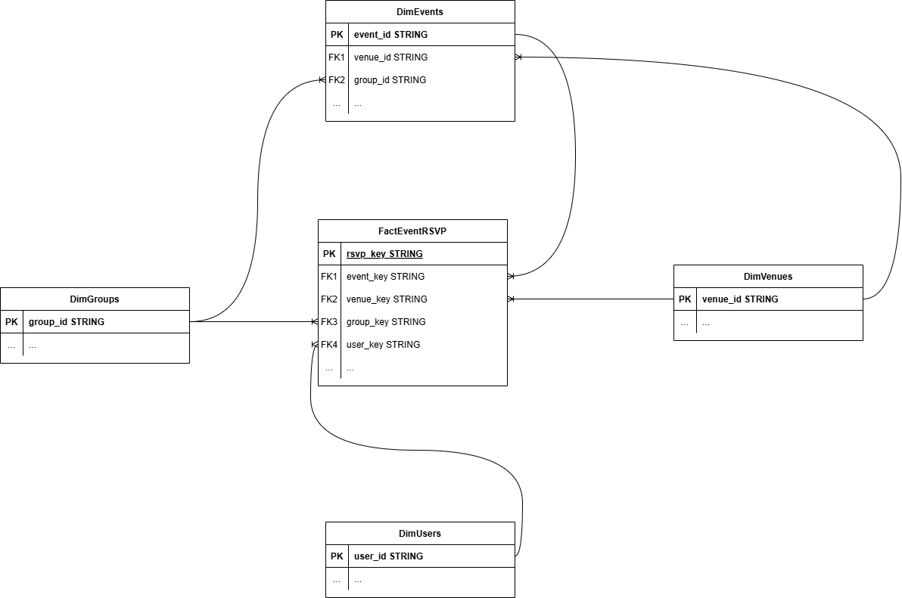
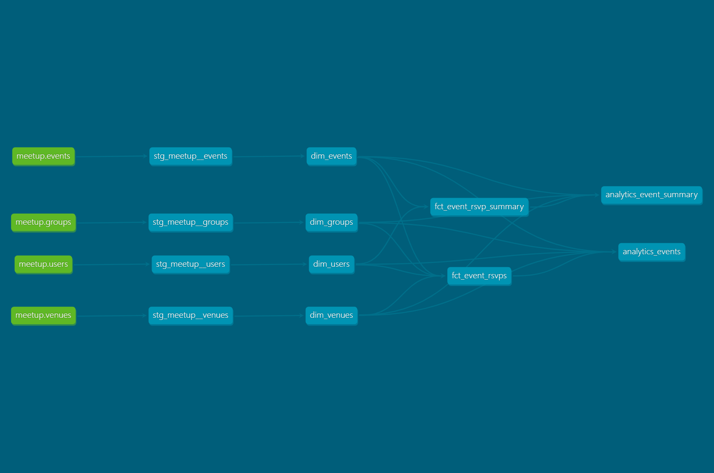

# Data Model Architecture

## Kimball Dimensional Modeling Approach

### 1. Select the Business Process
The key business processes identified for this Meetup.com data warehouse are:
- RSVP Management (Members responding to events)
- Group Membership Management (Future potential extension)

### 2. Declare the Grain
The model uses the following grains:
- **RSVP Fact**: One row per event RSVP per member
- **RSVP Summary Fact**: One row per event with aggregated RSVP metrics

This provides both atomic level detail and pre-aggregated metrics for flexible analysis.

### 3. Identify the Dimensions
- **Users**: Information about users/members
- **Groups**: Information about groups/organizations
- **Events**: Information about meetup events
- **Venues**: Information about event locations

### 4. Identify the Facts
- **Event RSVPs**: Measures related to event attendance and participation
  - RSVP responses (yes, no, waitlist)
  - Guest counts
  - Response timing metrics
- **Event RSVP Summary**: Aggregated event-level metrics
  - Total responses by type
  - Response rates
  - Attendance metrics

## Entity Relationship Diagram (ERD) - Core Models (No summary or analytics tables)

## Overall Architecture

This project implements a hybrid data architecture combining Kimball-style dimensional modeling for data integrity with denormalized analytics tables optimized for dashboard performance in Looker Studio.

## Design Layers

### 1. Staging Layer (`staging/`)
- Raw data from source systems with minimal transformations + some calculations
- Deduplication
- Consistent naming 
- Data quality validations (think about uniqueness, null presence, accepted values)

### 2. Dimensional Model (`marts/core/`)
- **Dimensions**: 
  - `dim_events`: Information about events
  - `dim_users`: Information about users/members
  - `dim_groups`: Information about groups/organizations
  - `dim_venues`: Information about event locations
- **Facts**: Measures and metrics that track business processes (RSVPs -> future group management?)
  - `fct_event_rsvps`: Event attendance and participation at individual RSVP level
  - `fct_event_rsvp_summary`: Aggregated summary metrics at the event level

### 3. Analytics Layer (`marts/analytics/`)
- Designed for specific reporting use cases (in this case Looker Studio)
  - `analytics_events`: Comprehensive event and RSVP information at individual RSVP level (joins have been performed as dashboard isn't build to handle joins well)
  - `analytics_event_summary`: Aggregated event metrics with dimensional context

## Design Choices & Rationale

### Denormalized Analytics Layer
I've created denormalized analytics tables specifically for Looker Studio:
- **Benefits**:
  - Better dashboard performance (single table scans vs joins) + Looker Studio doesn't handle joins well
- **Drawbacks**:
  - Data redundancy increases storage needs (table is quite small)
  - Can grow quite large over time

### Summary Tables
I've implemented aggregated summary tables at both fact and analytics layers:
- **Benefits**:
  - Allows for complex calculations (total_possible_attendants)
- **Drawbacks**:
  - Additional ETL overhead
  - Need to maintain consistency with detail tables

### Arrays vs Bridge Tables
I've kept arrays for topics and memberships in the analytics table:
- **Benefits**:
  - Simpler structure
  - Reduced model complexity
  - Works well for our current analytics needs
- **Drawbacks**:
  - Not ideal for detailed analysis of topics/memberships in other dashboard/use cases
  - Less aligned with pure dimensional modeling

## Future Improvements

Potential enhancements to consider:
1. Bridge tables for many-to-many relationships (topics, memberships)
2. Slowly changing dimension logic for entities that change over time
  - Think about adding valid_from_ts, valid_to_ts, is_current
3. More specialized analytics tables for specific dashboard use cases
4. Adding a group management table
